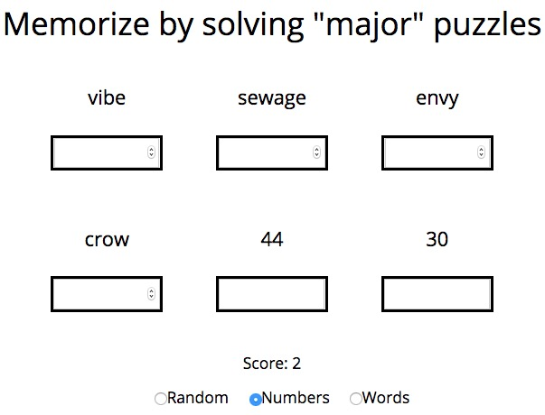

In attempt to learn backbone.js framework I've made a simple webapp. It allows you to practice [the major system](https://en.wikipedia.org/wiki/Mnemonic_major_system).

~~~ sh
$ npm install
$ npx http-server
~~~

